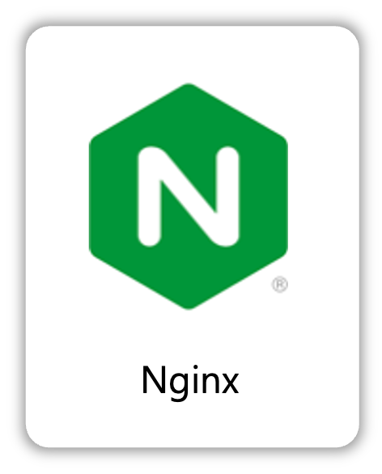

<!-- 프로젝트 로고 -->

### Recycle Project ✅

  

 

## 📝 소개
이 프로젝트는 사용자가 혼란스러워하는 물품에 대해 정확한 재활용 방법을 안내하고, 각 지역의 쓰레기 처리 규정을 간편하게 확인할 수 있도록 돕는 것을 목표로 하고 있습니다.

- 프로젝트 소개
- 프로젝트 화면 구성 또는 프로토타입
- 프로젝트 API 설계
- 사용된 기술 스택
- 프로젝트 아키텍처
- 기술적 이슈와 해결 과정
- 프로젝트 팀원 정보

모든 관련 이미지 파일은 `readme` 폴더 안에 저장되어 있습니다.

 

## 🌟 프로젝트 화면 구성 및 프로토타입

### 화면 구성
| 메인 화면 | 재활용 백과사전 |
|:---:|:---:|
|  |  |
| ai판독기 | 폐기물 연락처 |
|:---:|:---:|
|  |  |
|  | Screen #2 |
|:---:|:---:|
|  |  |

### 프로토타입

 

## 🗂️ APIs
API 설계 및 명세는 아래 링크에서 확인할 수 있습니다.

👉🏻 [API 바로보기](./backend/APIs.md)

 

## ⚙ 사용 기술 스택
프로젝트에서 사용된 기술 스택을 한 눈에 확인할 수 있습니다. 각 기술의 로고는 `readme/skills` 폴더에서 가져옵니다.

### Back-end

    
    
    
    

### Front-end

    

### Infra

    
    
    
    

### Tools

    
    
    

 

## 🛠 프로젝트 아키텍처

 

## 🤔 기술적 이슈와 해결 과정
각자 자신이 쓴 글을 올려주세요(링크걸어주세요)
- 황재욱
    - [Stream API에 대하여](https://velog.io/@yewo2nn16/Java-Stream-API)

- 서성우
    <!-- - [Stream API에 대하여](https://velog.io/@yewo2nn16/Java-Stream-API) -->

- 김희곤
    <!-- - [Stream API에 대하여](https://velog.io/@yewo2nn16/Java-Stream-API) -->

- 이상경
    <!-- - [Stream API에 대하여](https://velog.io/@yewo2nn16/Java-Stream-API) -->

- 이금주
    <!-- - [Stream API에 대하여](https://velog.io/@yewo2nn16/Java-Stream-API) -->

 

## 💁‍♂️ 프로젝트 팀원
| Backend | Backend | Frontend | Frontend | Frontend |
|:---:|:---:|:---:|:---:|:---:|
|  |   |  |  |  |
| [황재욱](https://github.com/jeauk) | [서성우](https://github.com/loteim) | [김희곤](https://github.com/kimhuigon) | [이상경](https://github.com/LSG20240516) | [이금주](https://github.com/l0cyp) |

