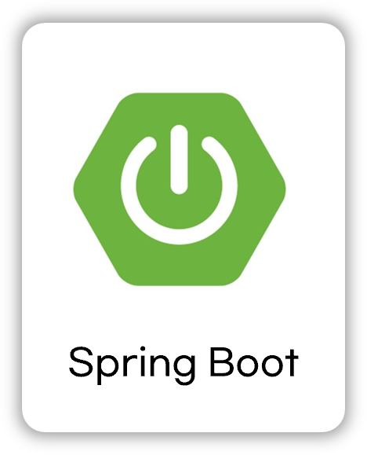

<!-- 프로젝트 로고 -->

### Recycle Project ✅

  

 

## 📝 소개
이 템플릿은 백엔드 프로젝트의 README.md를 빠르고 효율적으로 작성하기 위해 제작되었습니다. 프로젝트 정보를 명확히 전달할 수 있으며, 주요 내용은 아래와 같습니다:

- 프로젝트 소개
- 프로젝트 화면 구성 또는 프로토타입
- 프로젝트 API 설계
- 사용된 기술 스택
- 프로젝트 아키텍처
- 기술적 이슈와 해결 과정
- 프로젝트 팀원 정보

모든 관련 이미지 파일은 `readme` 폴더 안에 저장되어 있습니다.

 

## 🌟 프로젝트 화면 구성 및 프로토타입

### 화면 구성
| Screen #1 | Screen #2 |
|:---:|:---:|
|  |  |

### 프로토타입

 

## 🗂️ APIs
API 설계 및 명세는 아래 링크에서 확인할 수 있습니다.

👉🏻 [API 바로보기](./backend/APIs.md)

 

## ⚙ 사용 기술 스택
프로젝트에서 사용된 기술 스택을 한 눈에 확인할 수 있습니다. 각 기술의 로고는 `readme/skills` 폴더에서 가져옵니다.

### Back-end

    
    
    
    
    
    

### Front-end

    
    
    

### Infra

    

### Tools

    
    

 

## 🛠 프로젝트 아키텍처

 

## 🤔 기술적 이슈와 해결 과정
- Stream API 적용에 대한 고민
    - [Stream API에 대하여](https://velog.io/@yewo2nn16/Java-Stream-API)
- Gmail STMP를 사용한 이메일 전송
    - [Gmail 보내기 가이드](https://velog.io/@yewo2nn16/Email-이메일-전송하기with-첨부파일)
- AWS EC2에 배포
    - [서버 배포 가이드-1](https://velog.io/@yewo2nn16/SpringBoot-서버-배포)
    - [서버 배포 가이드-2](https://velog.io/@yewo2nn16/SpringBoot-서버-배포-인텔리제이에서-jar-파일-빌드해서-배포하기)

 

## 💁‍♂️ 프로젝트 팀원
| Backend | Frontend |
|:---:|:---:|
|  |  |
| [서성우](https://github.com/loteim) [황재욱](https://github.com/jeauk)| [김희곤](https://github.com/kimhuigon) [이상경](https://github.com/LSG20240516)[이금주](https://github.com/l0cyp)|

